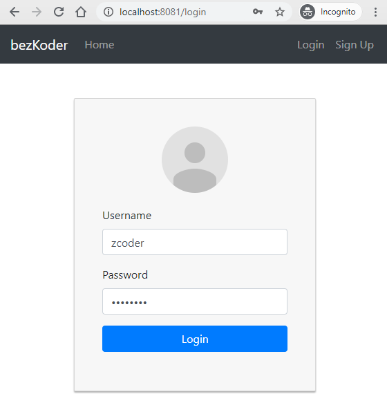
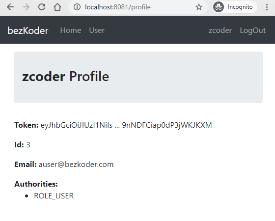

AAQC Dashboard

Signup Page:


Form Validation:


Login Page:



Profile Page:



### Set port
.env
```
PORT=8000
```

## Project setup

In the project directory, you can run:

```
yarn install
# or 
yarn

```
### Compiles and hot-reloads for development

```
yarn start

```

Open http://localhost:8000 to view it in the browser.

